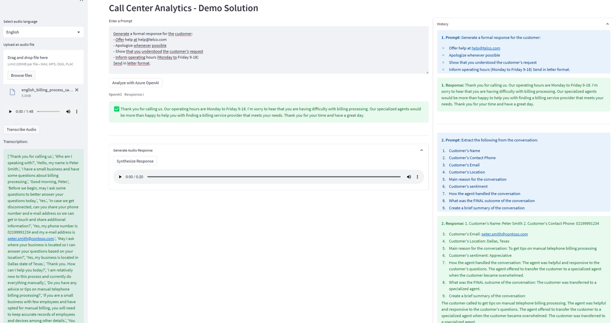

# Call Center Analytics Demo - Azure Cognitive Services (Speech) with Azure OpenAI Service

This sample demonstrates how to use Azure OpenAI Service to interact with audio transcriptions to analyze it, summarize, extract sentiment and even propose responses.

In this demo solution, we use Speech Service (Azure Cognitive Services) to transcribe an audio input that user can upload in multiple languages, Azure OpenAI Service to interact with this transcription with several prompts (summarize the audio, extract sentiment, etc) and Speech Service to optionally synthetize an audio response.

You can find sample audios and prompts to test in [audio](https://github.com/richardsonbq/aoai_callcenter/tree/main/audio) folder.

## Features

* Multi-language: you can select which language is the action and the prompts you'll enter. The solution will give all the outputs (including audio synthetization) in this language
* Visual interface to upload audio files, interact with it using Azure OpenAI and synthetize responses

## Getting Started

> **IMPORTANT:** In order to deploy and run this example, you'll need an **Azure subscription with access enabled for the Azure OpenAI service**. You can request access [here](https://aka.ms/oaiapply).

> **AZURE RESOURCE COSTS** this sample will create Azure App Service that has a monthly cost.

## Running the solution

### How To Run Locally
#### Prerequisites
- [Azure Developer CLI](https://aka.ms/azure-dev/install)
- [Python 3+](https://www.python.org/downloads/)
    - **Important**: Python and the pip package manager must be in the path in Windows for the setup scripts to work.
    - **Important**: Ensure you can run `python --version` from console. On Ubuntu, you might need to run `sudo apt install python-is-python3` to link `python` to `python3`.
- [Git](https://git-scm.com/downloads)
- [Azure OpenAI Service](https://learn.microsoft.com/en-us/azure/cognitive-services/openai/how-to/create-resource?pivots=web-portal) available in your Azure Subscription with one of the Completions model deployed (like text-davinci-002 or text-davinci-003)
- [Azure Speech service](https://learn.microsoft.com/en-us/azure/cognitive-services/speech-service/overview) available in your Azure Subscription

#### Deployment Steps
1. Clone the solution repository: `git clone https://github.com/richardsonbq/aoai_callcenter.git`
1. Install the requirements: `pip install -r requirements.txt`
1. Create environment variables in your local system and populate them with the corresponding values:

| **Variable**  | **Description** |
| --------  | -------- |
| **OPENAI_API_KEY**      | Use one of the keys of your Azure OpenAI Service |
| **OPENAI_API_ENDPOINT**      | The Endpoint of your Azure OpenAI Service |
| **OPENAI_API_COMPLETION_MODEL**      | Name of the GPT model that you have deployed in Azure OpenAI Service. Default: text-davinci-002 |
| **OPENAI_API_VERSION**      | Azure OpenAI Service Completion API version. Don't change unless a new version is available. Default: 2022-06-01-preview |
| **SPEECH_KEY**      | Use one of the keys of your Azure Speech Service |
| **SPEECH_SERVICE_REGION**      | The Azure region your Azure Speech Service is deployed. Default: eastus |

1. Finally, from the directory of the solution, start the web application by running in the terminal: `streamlit run app/app.py`

#### Automated Deployment
**Will be available soon**

