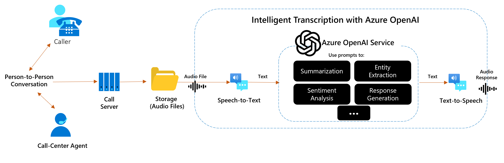
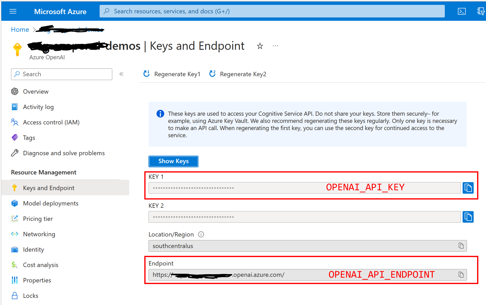
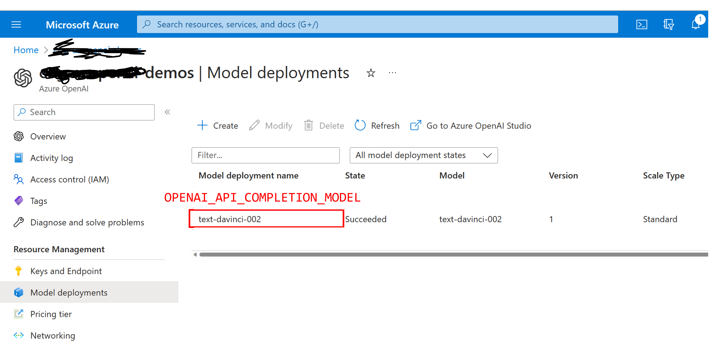
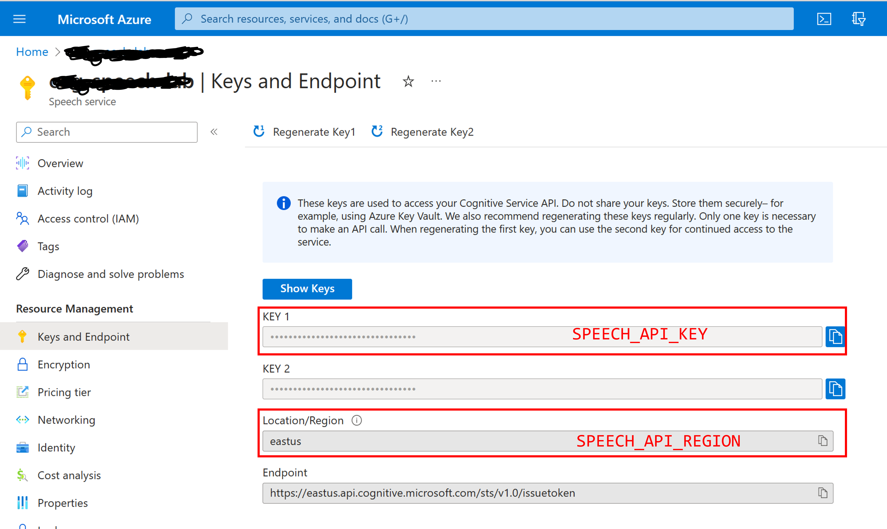

# Call Center Analytics Demo - Azure Cognitive Services (Speech) with Azure OpenAI Service

This sample demonstrates how to use Azure OpenAI Service to interact with an audio transcription to analyze, summarize, extract entities/sentiment and even propose responses.

In this demo solution, we use Speech Service (Azure Cognitive Services) to transcribe an audio input that user can upload in multiple languages, Azure OpenAI Service to interact with this transcription with several prompts (summarize the audio, extract sentiment, etc) and Speech Service to optionally synthetize an audio response. 

**Solution overview:**


You can find sample audios and prompts to test in [audio](https://github.com/richardsonbq/aoai_callcenter/tree/main/audio) folder. The application interface is as follows:


## Features

* Multi-language: you can select which language is the action and the prompts you'll enter. The solution will give all the outputs (including audio synthetization) in this language
* Visual interface to upload audio files, interact with it using Azure OpenAI and synthetize responses

## Getting Started

> **IMPORTANT:** In order to deploy and run this example, you'll need an **Azure subscription with access enabled for the Azure OpenAI service**. You can request access [here](https://aka.ms/oaiapply).

> **AZURE RESOURCE COSTS** this sample will create Azure App Service that has a monthly cost. Azure Speech Service has a default free tier (which is suggested as the default deployment option). Azure OpenAI Service depends on the usage of the solution, so you'll only be charged per the tokens of your requests (triggered by the interactions in the application).

## Running the solution


#### Automated Deployment
Just click on the following button and follow the instructions.

[](https://portal.azure.com/#create/Microsoft.Template/uri/https%3A%2F%2Fraw.githubusercontent.com%2Frichardsonbq%2Faoai_callcenter%2Fmain%2Fazuredeploy.json)

This option will deploy:
- **Azure Speech Service** that will be used to transcribe an audio file and synthetize audio responses.
- **Azure OpenAI Service** with one Completion model according to user selection in the deplyment template (default is text-davinci-002). This is the service to analyze and interact with the audio trascriptions.
- **Azure App Service** to run the Python application (User Interface). This is a simple application that leverages [Streamlit](https://docs.streamlit.io/) as a frontend.
- **Azure App Service Plan** to host the Python application in a dedicated Linux environment. 

Ensure the deployment succeeds. Some common errors can be:
- More than one Speech Service under free tier (F0). Change the tier before deploying (S0, for example) or delete older resources in your subscription.
- Ensure the Azure OpenAI Service is supported in the region selected (field "Location" of the deployment template). Besides, ensure that the selected region supports the selected Completion Model. You can check model's availability [here](https://learn.microsoft.com/en-us/azure/cognitive-services/openai/concepts/models#model-summary-table-and-region-availability). 

When the deployment succeeds, go to Azure Portal, find the App Service, go to "Overview" resource blade and click on the link in the "Default Domain" to open the application.

### How To Run Locally
#### Prerequisites
- [Azure Developer CLI](https://aka.ms/azure-dev/install)
- [Python 3+](https://www.python.org/downloads/)
    - **Important**: Python and the pip package manager must be in the path in Windows for the setup scripts to work.
    - **Important**: Ensure you can run `python --version` from console. On Ubuntu, you might need to run `sudo apt install python-is-python3` to link `python` to `python3`.
- [Git](https://git-scm.com/downloads)
- [Azure OpenAI Service](https://learn.microsoft.com/en-us/azure/cognitive-services/openai/how-to/create-resource?pivots=web-portal) available in your Azure Subscription with one of the Completions model deployed (like text-davinci-002 or text-davinci-003)
- [Azure Speech service](https://learn.microsoft.com/en-us/azure/cognitive-services/speech-service/overview) available in your Azure Subscription

#### Deployment Steps
1. Clone the solution repository: 
```console
git clone https://github.com/richardsonbq/aoai_callcenter.git
cd aoai_callcenter
```
1. Install the requirements: 
```console
pip install -r requirements.txt
```
1. Create environment variables in your local system and populate them:
    
    1. **Azure OpenAI Service**

    | **Variable**  | **Description** |
    | --------  | -------- |
    | **OPENAI_API_KEY**      | Use one of the keys of your Azure OpenAI Service |
    | **OPENAI_API_ENDPOINT**      | The Endpoint of your Azure OpenAI Service |
    | **OPENAI_API_COMPLETION_MODEL**      | Name of the GPT model that you have deployed in Azure OpenAI Service. Default: text-davinci-002 |
    | **OPENAI_API_VERSION**      | Azure OpenAI Service Completion API version. Don't change unless a new version is available. Default: 2022-06-01-preview |
    
    
    

    
    1. **Azure Speech Service**

    | **Variable**  | **Description** |
    | --------  | -------- |
    | **SPEECH_KEY**      | Use one of the keys of your Azure Speech Service |
    | **SPEECH_SERVICE_REGION**      | The Azure region your Azure Speech Service is deployed. Default: eastus |
    
    


1. Finally, from the directory of the solution, start the web application by running in the terminal:
```console
streamlit run app/app.py
```

## Limitations
#### Token limitation
This solution currently doesn't implement any technique for text chunking. Therefore, the number of Tokens from the Audio Transcription + User Prompt can't be greater than the maximum number of tokens of the selected completion model. You can check the updated maximum number of tokens per request [here](https://learn.microsoft.com/en-us/azure/cognitive-services/openai/concepts/models#gpt-3-models-1).
To estimate how many tokens a sequence of characters has, you can visit this [Tokenizer](https://platform.openai.com/tokenizer).
Finally, if you want to understand the concepts behind Tokens, check this [link](https://blog.quickchat.ai/post/tokens-entropy-question/).